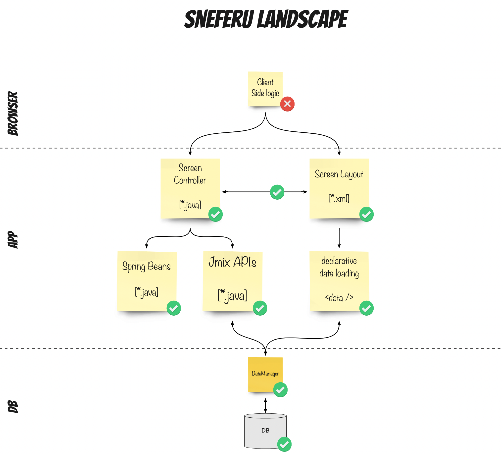

[](http://www.apache.org/licenses/LICENSE-2.0)


[](https://github.com/mariodavid/jmix-sneferu/releases/)
[](https://github.com/mariodavid/jmix-sneferu-example)
[](https://www.jmix.io/marketplace/sneferu)


## Sneferu

Sneferu is a testing library to simplify web integration testing for a CUBA application.
It consists of a couple of APIs that allow you to express interactions and verifications with UI screens via a dedicated high-level testing language. 


### Overview

Instead of spending too much time and money maintaining a selenium test suite, Sneferu is the way 
to have very good test coverage and quality assurance at a fraction of the cost.

Via its easy-to-read language you can create integration tests that are optimized for readability,
because this is what matters most for keeping a test suite maintainable & cheap to operate.

Sneferu enables you to:
 
* verify any business logic in a Screen Controller
* ensure the correct linking between a Screen XML and its Controller counterpart
* verify correct display of any programmatic creation of Screen Components / Dialogs
* emulate & verify data loading  
* emulate & verify Service Interface interactions

As Sneferu is based on the web integration test facilities of CUBA, there is a certain limitation in what areas are not covered. In particular, Sneferu relies on the abstractions provided by the CUBA and Vaadin component interfaces. It assumes that behind this interface everything "works as expected". 

What Sneferu _does not cover_:

* End-to-End data loading and displaying on a Screen
* End-to-End Service execution (middleware)
* Client-Side Vaadin UI logic that is executed only in the browser

#### Sneferu Landscape



If you can live with those trade-offs, feel free to join the lovely world of web integration testing in CUBA expressed through a beautiful API.

#### Motivation & Background

Testing of a CUBA application on the web layer mainly consists of two extremes:

1. write a unit test for the business logic in the screen controllers
2. write a functional UI test that executes the application through the browser

Both of those extremes have their downsides.

The first one requires mocking out every programmatic interaction with the CUBA UI interfaces. Also, unit tests do not cover any of the screen layout definitions or the data binding of a Screen.

Selenium-based UI testing, on the other hand, is much more black-box, slower, more brittle and overall harder to maintain. It can achieve a higher degree of confidence since the application behaves as it is supposed to, as it exercises the application almost as the user does. But this trade-off is a very expensive one. 

To mitigate that problem, CUBA 7.1 introduced web integration testing.

Sneferu is taking that new addition and brings it to the next level by making it accessible and very easy to use.

The documentation shows all test cases written in Spock, but Sneferu works with different testing frameworks like JUnit as well.

An example test case in Sneferu looks like this:

```java
public class VisitBrowseToEditTest {

  @Test
  public void aVisitCanBeCreated_whenAllFieldsAreFilled(
      @StartScreen StandardLookupTestAPI<Visit,VisitBrowse> visitBrowse,
      @SubsequentScreen StandardEditorTestAPI<Visit, VisitEdit> visitEdit,
      @NewEntity Pet pikachu
  ) {

    // given:
    pikachu.setName("Pikachu");

    // and:
    visitBrowse.interact(click(button("createBtn")));

    // when:
    OperationResult outcome = (OperationResult) visitEdit
        .interact(enter(dateField("visitDateField"), new Date()))
        .interact(enter(textField("descriptionField"), "Regular Visit"))
        .interact(select(lookupField("petField"), pikachu))
        .andThenGet(closeEditor());

    // then:
    assertThat(outcome).isEqualTo(OperationResult.success());

    // and:
    assertThat(environment.getUiTestAPI().isActive(visitEdit))
      .isFalse();

  }
}
```

### Getting Started

To use Sneferu, it is required to add the dependency to the CUBA project. In the `build.gradle` the following dependency has to be added to the web-module:

```groovy
configure(webModule) {
    // ...
    dependencies {
        testCompile('de.diedavids.sneferu:sneferu:**SNEFERU-VERSION**')
    }
}
```

Additionally the Maven repository `https://dl.bintray.com/mariodavid/cuba-components` has to be added to the list of available repositories of the project (`build.gradle`):

```groovy
repositories {
        
        // ...
        maven {
            url  "https://dl.bintray.com/mariodavid/cuba-components"
        }
        // ...
    }
```
| CUBA Platform Version | Add-on Version |
| --------------------- | -------------- |
| 7.2.x                 | 0.2.x - 0.3.x  |


The latest version is: [  ](https://bintray.com/mariodavid/cuba-components/sneferu/_latestVersion)


Sneferu can be used with JUnit as well as Spock. Just add the corresponding dependencies into your CUBA project to use it with any of those frameworks.

Afterward, you can create your first web integration test:

```groovy
import de.diedavids.sneferu.UiTestAPI

import static de.diedavids.sneferu.ComponentDescriptors.*
import static de.diedavids.sneferu.Interactions.*


class FirstSneferuSpec extends Specification {

    @Shared
    @ClassRule
    SneferuTestUiEnvironment environment =
            new SneferuTestUiEnvironment(TestImprovementsWebTestContainer.Common.INSTANCE)
                    .withScreenPackages(
                            "com.haulmont.cuba.web.app.main",
                            "com.rtcab.ddceti.web.screens.customer"
                    )
                    .withUserLogin("admin")
                    .withMainScreen(MainScreen)


    def "click a button, open a screen, enter some values and close the screen"() {

        given:
        def customerBrowse = environment.uiTestAPI.openStandardLookup(Customer, CustomerBrowse)

        when:
        customerBrowse
                .interact(click(button("createBtn")))

        and:
        environment.uiTestAPI.getOpenedEditorScreen(CustomerEdit)
                .interact(enter(textField("nameField"), "Bob Ross"))
                .andThenGet(closeEditor())

        then:
        environment.uiTestAPI.isActive(customerBrowse)
    }
}
```

Instead of using `com.haulmont.cuba.web.testsupport.TestUiEnvironment` a Sneferu-specific environment is used: `de.diedavids.sneferu.environment.SneferuUiTestExtension`

This environment-class has an additional parameter, that needs to be provided: `withMainScreen()`, where the Main Screen of the application is configured.

### Example Usage

A dedicated example of using Sneferu is shown via the CUBA Petclinic sample application: [cuba-platform/cuba-petclinic-using-sneferu](https://github.com/cuba-platform/cuba-petclinic-using-sneferu).

It contains a lot of example test cases that show the various usage options of Sneferu.


### Documentation

The different concepts when using Sneferu are described below. It mainly consists of the following:

1. `UiTestAPI`
2. `ScreenTestAPI` & `ScreenObject`
3. `ComponentTestAPI`
4. `Interactions`

Let's go through them one by one.

### UI Test API

The UI Test API is the interaction point in the test case that manages screens. The API allows the developer to open/close screens and retrieve information about the opened screens. It can be accessed through the `environment` instance via its method `getUiTestAPI()`. An example of its usage looks like this:

```groovy
def "UI Test API usage"() {

    given: 'a screen can be opened by the test case'
    def customerBrowse = environment.uiTestAPI
                            .openStandardLookup(Customer, CustomerBrowse)
                            
    and: 'a automatically opened screen can be retrieved'
    def customerEdit = environment.uiTestAPI
                        .getOpenedEditorScreen(CustomerEdit)

    then: 'information about active state of a screen can be retrieved'
    uiTestAPI.isActive(customerEdit)
}
```


#### JUnit 5 Screen Test Injection

When using JUnit, instead of imperatively interact with the `UiTestAPI`, it is also possible to directly inject the screens to the test, that the test should work upon.

An example looks like this:

```java
class JUnit5TestInjection {

  @Test
  public void a_screen_can_be_injected_to_directly_work_with_the_screens(
      @StartScreen StandardLookupTestAPI<Visit,VisitBrowse> visitBrowse,
      @SubsequentScreen StandardEditorTestAPI<Visit, VisitEdit> visitEdit
  ) {

    visitBrowse
        .interact(click(button("createBtn")));
    
    visitEdit
        .interact(enter(dateField("visitDateField"), new Date()));
    
    // ...

  }

}
```

In this case, the test case just expresses its dependencies for the screens that should be used. There are two variants to it:

* `@StartScreen` is used when a screen that needs to be started on should be injected. In case the screen is not already open in the application, it is not possible to inject it
* `@SubsequentScreen` is used when a screen should be injected in the test but is currently not already opened. In this case, the screen fetching from the application is postponed until the first interaction  

### Screen Test API

The next concept of Sneferu allows you to interact with a particular Screen and is called `ScreenTestAPI`. It consists of two main use-cases:

1. apply interactions (see [Interactions](#Interactions)) on a particular screen
2. retrieve components of a screen to interact with those through its [Component Test API](#Component-Test-API)

To interact with the `ScreenTestAPI` an instance of that must be retrieved via the `UiTestAPI` as described above. Once those instances are available (`customerBrowse` and `customerWithTabsEdit` in the following example), the API can be used to interact with a Screen via its Test API directly in the test case.

A usage example looks like this:

```groovy
def "Screen Test API usage"() {

    when: 'interactions are applied for a particular screen'
    customerBrowse
             .interact(click(button("createBtn")))

    and: 'components can be retrieved for further reference'
    customerWithTabsEdit
             .component(dateField("birthdayField"))
             .enter(today)
}
```

More information on what Interactions are and how they can be used can be found in the corresponding [Interactions](#Interactions) section.

The following classes exists for the `ScreenTestAPI`, that should be used based on the screen you interact with:

* `StandardScreenTestAPI` for all Screens that directly extend `Screen`
* `StandardLookupTestAPI` for all Screens that extend `StandardLookup`
* `StandardEditorTestAPI` for all Screens that extend `StandardEditor`

### Screen Objects

An extension of the ScreenTestAPI is the concept of a Screen Object.

Instead of using the API directly through the TestScreenAPI, it is also possible to create a [Screen Object](https://martinfowler.com/bliki/PageObject.html) that represents the API of a particular Screen of the UI. This allows creating a dedicated abstraction between the test case and the screen that is under test.

##### Definition of a Screen Object (CustomerBrowseScreenObject)

To create a ScreenObject, a class needs to be created representing one screen (in this case `CustomerBrowse`). It furthermore needs to implement the interface `ScreenObject<T extends ScreenTestAPI>`. 

```java
public class CustomerBrowseScreenObject implements 
    ScreenObject<StandardLookupTestAPI<Customer, CustomerBrowse>> {

    private StandardLookupTestAPI<Customer, CustomerBrowse> delegate;
    private final TestUiEnvironment testUiEnvironment;

    // ...

    public CustomerBrowseScreenObject searchForCustomer(Customer customer) {
        delegate
                .component(suggestionField("quickSearch"))
                .search(customer);

        return this;
    }

    public CustomerBrowseScreenObject searchForCustomer(String customerName) {

        Metadata metadata = testUiEnvironment.getContainer().getBean(Metadata.class);

        Customer customer = metadata.create(Customer.class);
        customer.setName(customerName);

        return searchForCustomer(customer);
    }

    public boolean isActive() {
        return testUiEnvironment.getUiTestAPI().isActive(delegate);
    }

}
```

With the above definition it is now possible to use this higher level abstraction in the different test cases:

##### Test Case with Screen Object

The shown test case is using the API of the ScreenObject, which consists of:

* `void searchForCustomer(String customerName)`
* `void searchForCustomer(Customer customer)`
* `boolean isActive()`

```groovy
def "screens can be used through its Screen Object Test API"() {

    given: "a screen object can be created using a factory method"
    def customerBrowseScreenObject = CustomerBrowseScreenObject.of(
            environment
    )

    and:
    customerBrowseScreenObject
            .searchForCustomer("Bob Ross")

    and: "a screen object can also be created via its constructor"
    def customerEditScreenObject = new CustomerEditScreenObject(
            uiTestAPI.getOpenedEditorScreen(CustomerEdit),
            environment
    )

    when:
    customerEditScreenObject
            .changeNameTo("Meggy Simpson")


    then:
    customerEditScreenObject
        .isClosed()

    and:
    customerBrowseScreenObject
        .isActive()
}
```

This variant allows having a higher abstraction in the test case. It also decouples the test cases from the API of the Screen itself.

### Component Test API

The next concept of Sneferu is the Component Test API. This API is the same thing for a `Component` as the `ScreenTestAPI` is for a CUBA Screen. It is an abstraction on top of the CUBA `Component` APIs that is designed in the context of testing.

To use an instance of a Component Test API, it has to be created in the test case (or the Screen Object) via its factory method:

````groovy
import static de.diedavids.sneferu.ComponentDescriptors.*

// ...

customerBrowse
             .component(suggestionField("customerSearchField"))
             .search("Bob Ross")
````

`suggestionField` is a factory method that is statically imported from the `ComponentDescriptors` class. The parameter `customerSearchField` is the ID of the field used in the Screen XML descriptor.

It returns an instance of a subclass of `ComponentDescriptor`. In this case, it returns an instance of `SuggestionFieldComponentDescriptor` which is aware of the specifics of this component (like searching the value via its `search` method).


#### Support custom components

Sneferu currently does not support all the components of CUBA. Furthermore, if you use application-specific components or composite components, Sneferu also can not support them out-of-the-box.

Therefore, it is possible to create custom Component Descriptors, that represent the component in the testing scenario.

To support a new component, first a subclass of `ComponentTestAPI` needs to be created:

```java
public class SliderTestAPI extends GenericComponentTestAPI<Slider> {
    public SliderTestAPI(Slider component) {
        super(component);
    }

    public SliderTestAPI slideTo(int value) {
        rawComponent().setValue(value);
        return this;
    }
}
```

With that component-specific Test API in place, a `ComponentDescriptor` can be created that is responsible for this `SliderTestAPI`:

```java
public class SliderComponentDescriptor
        extends GenericComponentDescriptor<Slider, SliderTestAPI> {

    public SliderComponentDescriptor(String componentId) {
        super(Slider.class, componentId);
    }

    @Override
    public SliderTestAPI createTestAPI(Slider component) {
        return new SliderTestAPI(component);
    }
}
```

The last step is to create a factory method that creates a new `SliderComponentDescriptor`:

```java
public class ApplicationComponentDescriptors {

    /**
     * creates a SliderComponentDescriptor instance
     * @param id the id of the component as defined in the screen XMl descriptor
     * @return a SliderComponentDescriptor instance
     */
    public static SliderComponentDescriptor slider(String id) {
        return new SliderComponentDescriptor(id);
    }
}
```

With those three steps, the custom component like the `Slider` in this example can be supported in the integration tests of the application.

### Interactions

The last remaining concept of Sneferu is the Interactions APIs. Interactions are what bring the screens to life. An interaction reflects any action a user would normally do manually to trigger some behavior or validate some result.

An interaction usage looks like this:

```groovy
import static de.diedavids.sneferu.ComponentDescriptors.button
import static de.diedavids.sneferu.Interactions.click

def "Interaction Usage"() {

    given:
    def customerBrowse = environment.uiTestAPI
                            .openStandardLookup(Customer, CustomerBrowse)

    when: 'using the click interaction'
        customerBrowse
                .interact(
                        /* the click interaction */
                        click( 
                            /* the target of the click interaction */
                            button("createBtn")
                        )
                )
}
```

An interaction invokes a `ScreenTestAPI` instance (like the `customerBrowse` instance in this case). Then it normally gets a target to act upon via a parameter (like the Component Descriptor `button("createBtn")` instance).

The Interaction then goes ahead and performs the desired action upon the target component.

All interactions can be created via its Factory: `de.diedavids.sneferu.Interactions`. Normally, from a readability point of view, it once again makes sense to use static imports for them:

`import static de.diedavids.sneferu.Interactions.*`

There are two types of Interactions:

#### Chainable Interactions 
Chainable interactions are interactions that can be combined via the `ScreenTestAPI` and with that represent a list of steps that should be executed against a Screen.

Those interactions do not have an outcome that can be retrieved programmatically in the test case. Examples of that are `click`, `select`, `openTab` etc.

The Screen Test API is a fluent API that allows you to chain interactions:

```groovy
def "Interactions can be chained"() {
    when:
    customerWithTabsEdit
             .interact(openTab(tabSheet("contentTabSheet"), "ordersTab"))
             .andThen(select(lookupField("orderType"), OrderType.BIG))
}
```
There are several alias methods, that can be used to underline the readability:

* `interact(Interaction interaction)`
* `andThen(Interaction interaction)`

#### Terminating Interactions

Terminating Interactions, on the other hand, return a value. By returning that value the chain of interactions is closed. An example of that is `closeEditor`. This interaction does two things:

1. closing the editor;
2. returning the `OperationResult` object to the test case that is received from the StandardEditor instance.

In the test case the result can be retrieved and used for verification purposes:

```groovy
when:
OperationResult result = customerEdit
        .interact(enter(textField("nameField"), "Bob Ross"))
        .andThenGet(closeEditor())

then:
result == OperationResult.success()
```

Terminating Interactions can be invoked via one of the following alias methods in the `ScreenTestAPI`:

* `verify(InteractionWithOutcome interaction)`
* `get(InteractionWithOutcome interaction)`
* `interactAndGet(InteractionWithOutcome interaction)`
* `andThenGet(InteractionWithOutcome interaction)`
* `andThenVerify(InteractionWithOutcome interaction)`

#### Using different Interactions

Here is an example of how to use the two different types of interactions in a test case:

```groovy
import static de.diedavids.sneferu.ComponentDescriptors.*
import static de.diedavids.sneferu.Interactions.*

def "Chainable Interactions can be combined to perform a series of steps"() {

    when: 'an order is placed from a customer editor screen'
    OperationResult operationResult = 
    
         customerWithTabsEdit

             /* start of an interaction chain */
             .interact(openTab(tabSheet("contentTabSheet"), "ordersTab"))
             /* next interaction: select */
             .andThen(select(lookupField("orderType"), OrderType.BIG))
             /* next interaction: click */
             .andThen(click(button("placeOrderBtn")))
        
             /* terminating interaction: closeEditor */
             .andThenGet(closeEditor())
}
```

#### Custom Interactions

It is possible to define a custom Interaction that is not included in the Sneferu library (yet).

Taking the Slider example from above: the first step is to create a class defining the Interaction:

```java
import de.diedavids.sneferu.Interaction;
import de.diedavids.sneferu.screen.ScreenTestAPI;

public class SlideInteraction implements Interaction<ScreenTestAPI> {

    private final int value;
    private final SliderComponentDescriptor componentDescriptor;

    public SlideInteraction(SliderComponentDescriptor sliderComponentDescriptor, int value) {
        this.componentDescriptor = sliderComponentDescriptor;
        this.value = value;
    }

    @Override
    public void execute(ScreenTestAPI screenTestAPI) {
        ((Slider)screenTestAPI.component(componentDescriptor)
                .rawComponent())
                .setValue(value);
    }
}
```

After that, the second optional step is to define a factory method that instantiates a new `SlideInteraction` so that it can be easily used in the test case.

```java
public class ApplicationInteractions {

    public static <C extends Component, F extends ComponentTestAPI<C>> SlideInteraction slide(
            ComponentDescriptor<C, F> componentDescriptor,
            Object value
    ) {
        return new SlideInteraction(componentDescriptor, value);
    }
}
```


With that it is possible to use it directly in a test case:

```groovy
import static ApplicationInteractions.slide
import static ApplicationComponentDescriptors.slider

def "a slider component can be used through its custom interaction"() {

    when: 'an order is placed from a customer editor screen'
         customerEditor
             .interact(slide(slider("ageSlider"), 24))
}
```
